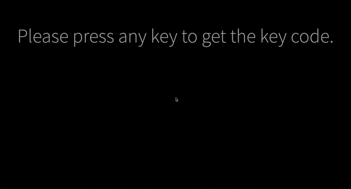

<p align="center">
  
</p>

<h1 align="center">Key Code</h1>
<p align="center">Keycode returns the Unicode character code of the key.<br> (Inspired from <a href="http://keycode.info)">keycode.info</a>)</p>


[](https://forthebadge.com) [](https://forthebadge.com)

<p align="center">
  
</p>

## Installation

### Clone

**1.)** Clone the repository by using this link :

```
$ git clone https://github.com/vaibhavsingh97/key-code.git
```

## Run

Open `index.html` file.

## Demo

open http://vaibhavsingh97.com/key-code/

## Issues

You can report the bugs at the [issue tracker](https://github.com/vaibhavsingh97/key-code/issues)

## License

Built with ♥ by Vaibhav Singh([@vaibhavsingh97](https://github.com/vaibhavsingh97)) under [MIT License](https://vaibhavsingh97.mit-license.org/)

You can find a copy of the License at <https://vaibhavsingh97.mit-license.org/>
Keycode returns the Unicode character code of the key
